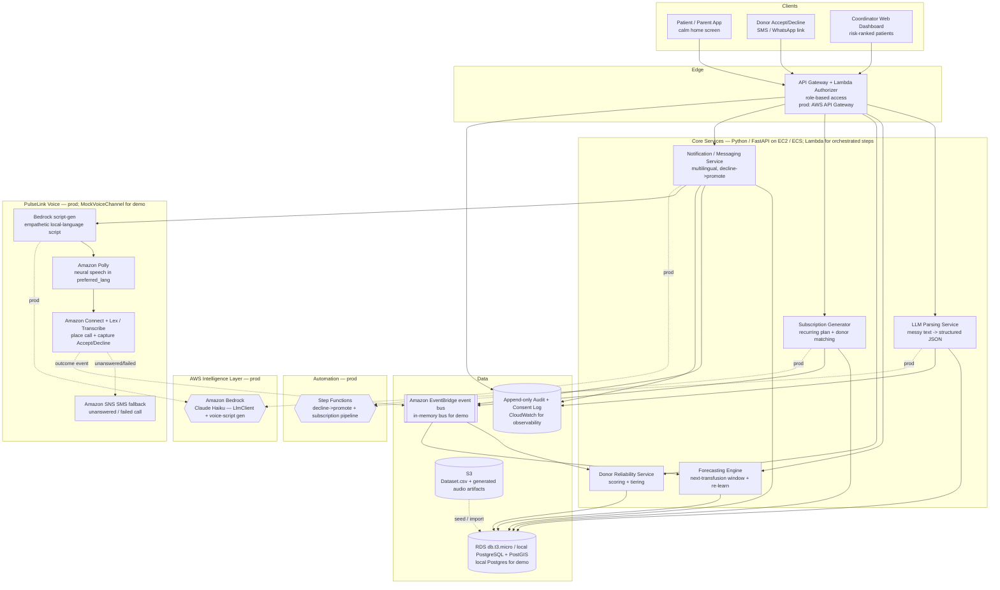
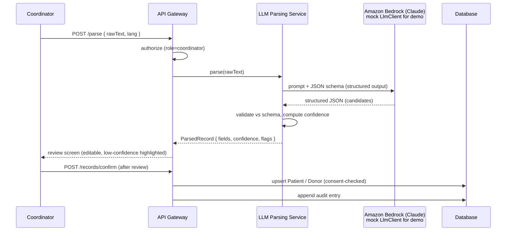
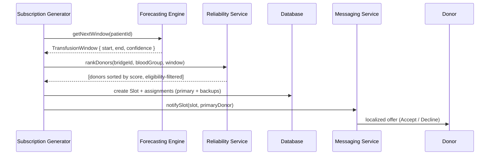
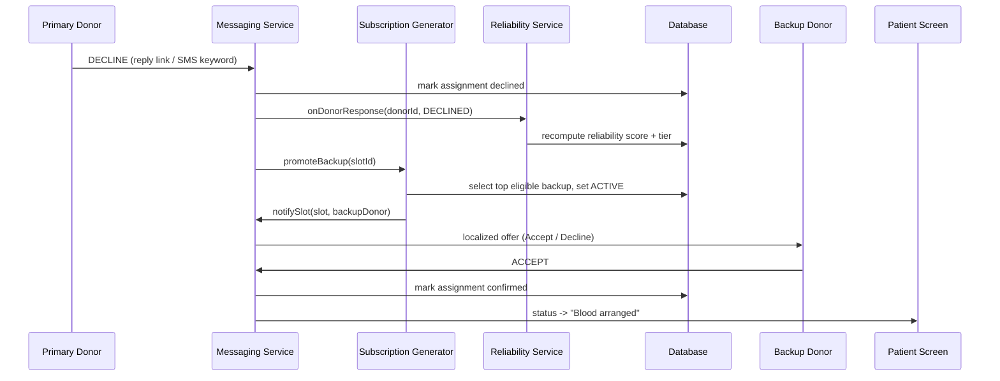
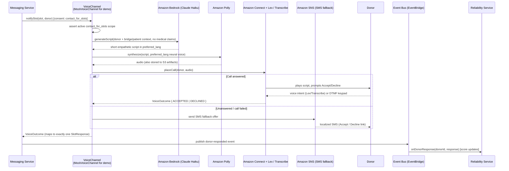

# Design Document: PulseLink — The Blood Subscription for Thalassemia Care

## Overview

PulseLink turns lifelong, recurring blood transfusions for Thalassemia Major patients into a managed **subscription** instead of a series of disconnected emergencies. Today every transfusion is treated as a fresh panic: families scramble, coordinators re-do work, and there is no memory of which donors were reliable. PulseLink gives the system a memory and a forecast.

Three surfaces sit on one platform: a **calm patient/parent home screen** that shows blood is already arranged, a **multilingual donor accept/decline screen** reachable over SMS/WhatsApp (no app install), and a **coordinator web dashboard** that ranks patients by risk of missing a transfusion. Behind these, five services do the work: an **LLM parsing service** that converts messy WhatsApp-style records into clean structured data (the core, meaningful AI use), a **forecasting engine** that predicts each patient's next transfusion *window* and re-learns after every recorded transfusion, a **donor reliability scoring service** that tiers donors into anchor/steady/growing, a **subscription generator** that builds each patient's recurring plan with matched primary and backup donors, and a **notification/messaging service** that drives the decline → auto-promote-backup flow.

The design is grounded in a real Blood Warriors–style dataset (`Dataset.csv`) that uses a **"bridge"** concept: a bridge is the recurring patient–donor support group around one Thalassemia patient. Donors are tagged `Bridge Donor`, `Emergency Donor`, or `Volunteer`, and rows already carry the signals PulseLink needs — `frequency_in_days` (transfusion cadence), `last_transfusion_date` / `expected_next_transfusion_date`, `donations_till_date`, `calls_to_donations_ratio`, `eligibility_status`, and `next_eligible_date`. PulseLink reuses these signals rather than inventing new ones.

> **Assumptions (stated explicitly):**
> - The `Problem Statement.pdf` and `PulseLinkPPT.pdf` in the workspace could not be parsed by this design pass; the design is built from the written project brief plus the real schema observed in `Dataset.csv`, plus standard best practices.
> - The dataset's `bridge_id` is treated as the anchor of a **Patient/Bridge** entity. The dataset is donor-centric and does not contain explicit patient PII; PulseLink models patients as first-class entities derived from bridges and enriched by coordinator/LLM input.
> - All hackathon flows run on **seeded data**; no live third-party SMS/WhatsApp or hospital integrations are required for the demo, but the messaging service is designed behind an interface so a real provider can be plugged in for production.
> - "Blood arranged" reassurance shown to patients is derived from confirmed donor slot acceptances, never a guarantee of a medical outcome.

## Goals and Non-Goals

**Goals**
- Replace per-transfusion emergency requests with an auto-generated recurring subscription per patient.
- Use an LLM specifically to extract clean structure from chaotic unstructured records — meaningful AI, not AI-for-show.
- Predict a transfusion *window* (range), and improve the prediction after each recorded transfusion.
- Score and tier donors by real reliability, and auto-promote a backup when a donor declines.
- Be multilingual for donors (Indian languages) and reachable without an app install.
- Be scalable city-by-city, with privacy and role-based access built in from day one.

**Non-Goals**
- No medical dosing, diagnosis, or clinical decision-making.
- No real-money payments or blood-bank inventory management in v1.
- No guarantee of donor turnout; PulseLink optimizes probability and lead time, not certainty.

## Glossary

| Term | Meaning in PulseLink |
|------|----------------------|
| Bridge | The recurring support group around one Thalassemia patient (from dataset `bridge_id`). |
| Subscription | A patient's forward-looking recurring plan of transfusion slots + matched donors. |
| Slot | A single upcoming transfusion occurrence needing one or more donor commitments. |
| Window | The predicted date *range* a patient's next transfusion is expected. |
| Anchor / Steady / Growing | Donor reliability tiers, highest to lowest. |
| Auto-promote | Replacing a declined donor with the best available backup automatically. |
| PulseLink Voice | The AI voice agent that automatically calls a donor in their own language to offer a slot, replacing manual coordinator phone calls and directly attacking the dataset's high `calls_to_donations_ratio`. |
| VoiceChannel | A pluggable `MessageChannel` implementation that places a voice call (Bedrock-generated script → Polly speech → Connect/Lex/Transcribe capture → SNS SMS fallback). `MockVoiceChannel` serves the offline demo. |
| calls_to_donations_ratio | Dataset signal counting outreach calls per realized donation; some donors show 19:1 or 23:1. PulseLink Voice's headline impact metric is reducing calls-per-donation. |

## Architecture

PulseLink uses a modular service-oriented architecture. Each capability is a service behind a clear interface so it can scale independently and so seeded-data adapters can be swapped for real providers in production.



**Architectural principles**

- **Seeded-data first, provider-pluggable.** The messaging and LLM services sit behind interfaces (`MessageChannel`, `LlmClient`) so the hackathon demo runs entirely on seeded data and mock channels, while production swaps in a real WhatsApp Business / SMS gateway and **Amazon Bedrock (Anthropic Claude)** without touching business logic. A local PostgreSQL stands in for **RDS (`db.t3.micro`)** during the demo.
- **Event-driven re-learning.** Recording a transfusion or a donor decline publishes an event on the bus — **Amazon EventBridge** in the budget production profile (pay-per-event, no idle shard cost), a local in-memory bus for the demo. The forecasting engine consumes "transfusion recorded" to refine cadence; the reliability service consumes "donor responded" — including outcomes captured by **PulseLink Voice** — to update scores. This keeps the live demo's decline → promote → re-score flow loosely coupled and observable, and closes the loop on `calls_to_donations_ratio` when a voice call resolves a slot.
- **City as a partition key.** Every patient, donor, and bridge carries a `city_id`. Matching, dashboards, and forecasts are always scoped by city, which lets PulseLink scale by adding cities horizontally on RDS PostgreSQL + stateless FastAPI (see Scalability).
- **Privacy by construction.** The append-only audit/consent log is separate from operational data, and the gateway enforces role-based access on every call via IAM + API Gateway authorizers (see Security & Privacy).

### Request flow (high level)

1. Coordinator pastes a messy WhatsApp record → **LLM Parsing Service** returns structured patient/donor JSON for review and save.
2. **Forecasting Engine** computes each patient's next transfusion window from their cadence history.
3. **Subscription Generator** builds the recurring plan, matching eligible, reliable donors (primary + ranked backups) per slot.
4. **Messaging Service** sends each matched donor a multilingual slot offer with Accept/Decline.
5. On **Decline**, the system auto-promotes the top backup, notifies them, and the **Reliability Service** lowers the decliner's score. The patient screen stays calm — it only ever shows "arranged" once a confirmed donor exists.

## Sequence Diagrams

### Flow 1: LLM parsing of a messy record



### Flow 2: Subscription generation + donor offer



### Flow 3: Decline → auto-promote backup → re-score (the live demo)



### Flow 4: PulseLink Voice — AI voice-call accept/decline

When a slot offer is needed, the messaging service routes it to the `VoiceChannel` instead of (or alongside) SMS/WhatsApp. The voice agent generates an empathetic, local-language script, speaks it via Polly, places the call over Connect, and captures the donor's Accept/Decline by voice (Lex/Transcribe) or DTMF keypad. The outcome is published to the event bus so the reliability score updates — closing the loop on `calls_to_donations_ratio`.



## Components and Interfaces

> **Implementation note (stack):** All five services are **Python / FastAPI** services. The interface contracts below are written in TypeScript-style notation purely for brevity and readability; each is implemented in Python with Pydantic models for request/response validation and `async` endpoints. (Earlier drafts split the gateway, subscription generator, and messaging service onto TypeScript/NestJS — that split has been removed and the entire backend is now standardized on Python/FastAPI so a single runtime serves REST + async processing.) In production, FastAPI handlers run on EC2/ECS and are also packaged as AWS Lambda functions fronted by API Gateway; the orchestrated multi-step flows (subscription generation, decline → auto-promote → re-score) are coordinated by AWS Step Functions.

### Component 1: LLM Parsing Service

**Purpose**: Convert chaotic, multilingual, free-text WhatsApp-style records into clean, validated, structured patient/donor data. This is PulseLink's core meaningful AI use.

**Responsibilities**:
- Call the LLM with a strict JSON schema (structured output) and a few-shot prompt.
- Validate model output against the schema; never trust raw model text.
- Attach a per-field confidence and flag low-confidence fields for human review.
- Normalize dates, blood groups, phone numbers, and language tags.
- Emit nothing to the operational store until a coordinator confirms.

**Interface**:
```typescript
interface LlmParsingService {
  parse(input: ParseRequest): Promise<ParsedRecord>;
}

interface ParseRequest {
  rawText: string;            // messy WhatsApp-style message
  sourceLang?: string;        // optional hint, e.g. "te", "hi", "en"
  cityId: string;
}

interface ParsedRecord {
  patient?: Partial<Patient>;
  donors: Partial<Donor>[];
  fieldConfidence: Record<string, number>; // 0..1 per dotted field path
  reviewFlags: ReviewFlag[];                // fields needing human review
  modelVersion: string;
}

interface ReviewFlag {
  fieldPath: string;
  reason: "low_confidence" | "ambiguous" | "missing" | "conflicting";
}
```

### Component 2: Forecasting Engine

**Purpose**: Predict each patient's next transfusion window (a range, not a fixed day) and re-learn cadence after each recorded transfusion.

**Responsibilities**:
- Maintain a per-patient cadence estimate from transfusion history (seeded by `frequency_in_days`).
- Produce a window `[start, end]` with a confidence value.
- Re-estimate cadence on each new `TransfusionRecord` (event-driven).

**Interface**:
```typescript
interface ForecastingEngine {
  getNextWindow(patientId: string): Promise<TransfusionWindow>;
  recordTransfusion(record: TransfusionRecord): Promise<CadenceEstimate>; // triggers re-learn
}

interface TransfusionWindow {
  patientId: string;
  start: string;       // ISO date (inclusive)
  end: string;         // ISO date (inclusive)
  expected: string;    // most-likely date within the window
  confidence: number;  // 0..1
  basedOnSamples: number;
}
```

### Component 3: Donor Reliability Service

**Purpose**: Score donors and assign tiers (anchor / steady / growing) from commitment history.

**Responsibilities**:
- Compute a reliability score from acceptance ratio, recency, donation count, and call-efficiency.
- Map score to a tier with documented thresholds.
- Recompute on each donor response event.

**Interface**:
```typescript
interface ReliabilityService {
  scoreDonor(donorId: string): Promise<ReliabilityScore>;
  rankDonors(query: DonorMatchQuery): Promise<RankedDonor[]>;
  onDonorResponse(donorId: string, response: SlotResponse): Promise<ReliabilityScore>;
}

interface DonorMatchQuery {
  bridgeId: string;
  bloodGroup: BloodGroup;
  window: TransfusionWindow;
  cityId: string;
  excludeDonorIds?: string[];
}

interface RankedDonor {
  donorId: string;
  score: number;       // 0..100
  tier: DonorTier;     // "anchor" | "steady" | "growing"
  eligibleOn: string;  // earliest eligible date within/with window
}
```

### Component 4: Subscription Generator

**Purpose**: Build and maintain each patient's recurring plan, matching a primary donor plus ranked backups per slot. *(Python/FastAPI service — previously TypeScript/NestJS; the subscription-generation and decline→promote flows run as AWS Step Functions state machines invoking Lambda functions in production.)*

**Interface**:
```typescript
interface SubscriptionGenerator {
  generate(patientId: string, horizonDays: number): Promise<Subscription>;
  promoteBackup(slotId: string): Promise<SlotAssignment>; // used on decline
  regenerateFromWindow(patientId: string): Promise<Subscription>;
}
```

### Component 5: Notification / Messaging Service

**Purpose**: Deliver multilingual slot offers and handle Accept/Decline over SMS/WhatsApp-style channels without requiring an app install. *(Python/FastAPI service — previously TypeScript/NestJS; high-write notification/slot-assignment state may use DynamoDB in production.)*

**Interface**:
```typescript
interface MessagingService {
  notifySlot(slot: Slot, donor: Donor): Promise<Notification>;
  handleInbound(inbound: InboundMessage): Promise<void>; // ACCEPT / DECLINE keyword or link
}

// Channels are pluggable: MockChannel for the demo, real provider in prod.
interface MessageChannel {
  send(to: ContactPoint, body: LocalizedMessage): Promise<DeliveryReceipt>;
}

interface LocalizedMessage {
  lang: string;            // donor's preferred language
  text: string;            // rendered from a translation template
  actions: MessageAction[]; // Accept / Decline deep links or keywords
}
```

### Component 6: Coordinator Dashboard / Patient App / Donor Interface (clients)

- **Coordinator Dashboard**: web app listing patients sorted by `RiskScore` (descending), with subscription detail and a paste-to-parse box for the LLM service.
- **Patient/Parent App**: minimal home screen showing the next transfusion window and an "arranged / arranging" status — designed to reduce anxiety, with no request buttons by default.
- **Donor Interface**: a single localized screen (opened from an SMS/WhatsApp link) showing one slot and two buttons: Accept / Decline.

### Component 7: PulseLink Voice (AI Voice Agent)

**Purpose**: Replace manual coordinator phone calls with an automated, empathetic, local-language voice outreach call when a slot needs filling. This directly attacks the dataset's `total_calls` / `calls_to_donations_ratio` inefficiency (some donors show 19:1 and 23:1 call-to-donation ratios) — the headline impact metric is **reducing calls-per-donation**. PulseLink Voice is also an accessibility / AI-for-good lever: it reaches donors who cannot read or will not install an app, speaking to them in their mother tongue (Telugu / Hindi / Tamil / English).

**Design seam**: `VoiceChannel` is a new implementation of the existing pluggable `MessageChannel` interface, so it sits alongside SMS/WhatsApp and the `MockChannel`. The demo uses a **`MockVoiceChannel`** (plays the generated Polly audio locally / simulates a keypad response) so the flow runs entirely offline; production uses **Amazon Connect + Lex/Transcribe + Polly + SNS**. The consent gate (active `contact_for_slots` scope) applies to voice calls exactly as to every other channel.

**Responsibilities**:
- Generate a short, personalized, empathetic call **script** via **Amazon Bedrock (Claude Haiku)**, grounded in donor + patient/bridge context, with **no medical claims**.
- Synthesize the script to **speech** via **Amazon Polly** in the donor's `preferred_lang` (Polly Indian-language / neural voices); persist the audio artifact to S3.
- **Place the call** over **Amazon Connect** and **capture** the donor's Accept/Decline via **Amazon Lex / Amazon Transcribe** (voice intent) and/or **DTMF keypad**.
- Fall back to an **Amazon SNS** SMS offer when the voice call fails or is unanswered.
- Map the captured response to exactly one `SlotResponse` and feed the outcome back through the event bus so the **Reliability Service** updates the donor's score — closing the loop on `calls_to_donations_ratio`.

**Interface**:
```typescript
// VoiceChannel is a MessageChannel, so the Messaging Service treats it like any
// other channel (SMS / WhatsApp / Mock). MockVoiceChannel implements it for the demo.
interface VoiceChannel extends MessageChannel {
  // generate an empathetic, local-language script grounded in donor + bridge context
  generateScript(ctx: VoiceCallContext): Promise<VoiceScript>;        // Amazon Bedrock (Claude Haiku)
  // synthesize the script to speech in the donor's preferred language
  synthesize(script: VoiceScript, lang: string): Promise<VoiceAudio>; // Amazon Polly
  // place the call and capture Accept/Decline (voice intent or DTMF)
  placeCall(to: ContactPoint, audio: VoiceAudio): Promise<VoiceOutcome>; // Amazon Connect + Lex/Transcribe
}

interface VoiceCallContext {
  donorId: string;
  slotId: string;
  lang: string;             // donor preferred_lang
  bridgeContext: string;    // patient/bridge framing; NO medical claims
}

interface VoiceScript {
  lang: string;
  text: string;             // short, empathetic, grounded in context
  modelVersion: string;
}

interface VoiceAudio {
  lang: string;
  audioUri: string;         // S3 artifact (local file for the demo)
  durationMs: number;
}

interface VoiceOutcome {
  donorId: string;
  slotId: string;
  response: SlotResponse;   // ACCEPTED | DECLINED | NO_RESPONSE
  capturedVia: "voice_intent" | "dtmf" | "sms_fallback";
  fallbackUsed: boolean;    // true when SNS SMS fallback was triggered
}
```

## Data Models

Field names borrow directly from `Dataset.csv` where possible so the seeded data maps cleanly. PII is minimized: contact details live in a separate `ContactPoint` table gated by consent, and the analytics/matching tables hold only what the algorithms need.

```typescript
type BloodGroup =
  | "A Positive" | "A Negative" | "B Positive" | "B Negative"
  | "AB Positive" | "AB Negative" | "O Positive" | "O Negative";

type DonorTier = "anchor" | "steady" | "growing";
type SlotStatus = "planned" | "offered" | "confirmed" | "fulfilled" | "missed";
type AssignmentStatus = "active" | "declined" | "confirmed" | "promoted" | "expired";
type SlotResponse = "ACCEPTED" | "DECLINED" | "NO_RESPONSE";
```

### Patient (derived from a bridge)

```typescript
interface Patient {
  patientId: string;        // maps to dataset bridge_id
  cityId: string;
  bloodGroup: BloodGroup;   // bridge_blood_group
  quantityRequired: number; // units per transfusion (quantity_required)
  cadenceDays: number;      // current cadence estimate (seed: frequency_in_days)
  lastTransfusionDate: string | null;     // last_transfusion_date
  expectedNextTransfusionDate: string | null; // expected_next_transfusion_date
  bridgeStatus: "active" | "inactive";     // status_of_bridge
  consentId: string;        // FK to Consent
  // No name/phone here — see ContactPoint (consent-gated).
}
```

**Validation rules**:
- `cadenceDays > 0` and within a sane clinical band (7–45 days typical for Thalassemia Major; values outside are flagged, not rejected).
- `quantityRequired >= 1`.
- A `Patient` must reference a valid, non-revoked `Consent`.

### TransfusionRecord

```typescript
interface TransfusionRecord {
  recordId: string;
  patientId: string;
  date: string;             // actual transfusion date (ISO)
  unitsGiven: number;
  fulfilledBySlotId?: string;
  recordedBy: string;       // coordinator userId (audit)
}
```

**Validation rules**: `date` not in the future; `unitsGiven >= 1`; recording a transfusion triggers cadence re-learning.

### Donor

```typescript
interface Donor {
  donorId: string;          // dataset user_id
  cityId: string;
  bloodGroup: BloodGroup;
  role: "Bridge Donor" | "Emergency Donor" | "Volunteer"; // dataset role
  donorType: "Regular Donor" | "One-Time Donor" | "Other"; // donor_type
  preferredLang: string;    // for multilingual messaging, e.g. "te","hi","en"
  lat: number;              // latitude
  lng: number;              // longitude
  lastDonationDate: string | null;   // last_donation_date
  nextEligibleDate: string | null;   // next_eligible_date
  eligibilityStatus: "eligible" | "not eligible"; // eligibility_status
  donationsTillDate: number;         // donations_till_date
  totalCalls: number;                // total_calls
  callsToDonationsRatio: number;     // calls_to_donations_ratio
  consentId: string;
}
```

**Validation rules**: `nextEligibleDate` governs whether a donor can be offered a slot; matching must never offer a slot before `nextEligibleDate`. `donationsTillDate >= 0`.

### ReliabilityScore

```typescript
interface ReliabilityScore {
  donorId: string;
  score: number;            // 0..100
  tier: DonorTier;
  components: {
    acceptanceRatio: number;   // accepted / offered
    recencyFactor: number;     // decays with time since last donation
    volumeFactor: number;      // grows with donationsTillDate (capped)
    callEfficiency: number;    // inverse of calls_to_donations_ratio
  };
  computedAt: string;
}
```

### Subscription, Slot, SlotAssignment

```typescript
interface Subscription {
  subscriptionId: string;
  patientId: string;
  cadenceDays: number;
  horizonDays: number;      // how far ahead slots are generated
  slots: Slot[];
  createdAt: string;
  updatedAt: string;
}

interface Slot {
  slotId: string;
  subscriptionId: string;
  patientId: string;
  window: { start: string; end: string; expected: string };
  unitsNeeded: number;
  status: SlotStatus;
  assignments: SlotAssignment[]; // one active primary + ordered backups
}

interface SlotAssignment {
  assignmentId: string;
  slotId: string;
  donorId: string;
  rank: number;             // 0 = primary, 1..n = backups in promote order
  status: AssignmentStatus;
  offeredAt?: string;
  respondedAt?: string;
}
```

**Validation rules**: at most one assignment per slot is `active`/`confirmed` as primary at a time; backups carry ascending `rank`; promoting a backup sets the next-best `active`.

### Notification

```typescript
interface Notification {
  notificationId: string;
  donorId: string;
  slotId: string;
  channel: "sms" | "whatsapp" | "voice" | "mock";
  lang: string;
  status: "queued" | "sent" | "delivered" | "responded" | "failed";
  response?: SlotResponse;
  sentAt?: string;
  respondedAt?: string;
}
```

### Consent + ContactPoint (privacy-critical)

```typescript
interface Consent {
  consentId: string;
  subjectId: string;        // patientId or donorId
  subjectType: "patient" | "donor";
  scopes: ConsentScope[];   // what data may be used and for what
  grantedAt: string;
  revokedAt?: string | null;
  version: string;          // consent text version
}

type ConsentScope =
  | "store_contact"
  | "contact_for_slots"
  | "share_with_coordinator"
  | "use_in_forecasting";

interface ContactPoint {
  contactId: string;
  subjectId: string;
  type: "phone" | "whatsapp";
  valueEncrypted: string;   // encrypted at rest; never logged in plaintext
  preferredLang: string;
}
```

**Validation rules**: no message may be sent to a `ContactPoint` whose subject lacks an active `contact_for_slots` consent scope; revoking consent cascades to suppress future notifications.

## Low-Level Design

This section gives the concrete algorithms: the LLM structured-output approach, the transfusion-window forecast with re-learning, the reliability scoring formula and tiers, and the decline → auto-promote-backup algorithm.

### 4.1 LLM Parsing: structured-output approach

The LLM is never asked for prose. It is constrained to emit JSON matching a fixed schema, the output is validated, and low-confidence fields are routed to a human. This makes the AI use both meaningful (it solves the real "messy text → clean data" problem) and safe (no unvalidated model text reaches the database).

**Prompt strategy**
- **System prompt**: role = strict data-extraction engine; rules = output only schema-valid JSON, never guess a value not supported by the text (use `null` + a flag), preserve original-language names, normalize dates to ISO and blood groups to the canonical enum.
- **Few-shot examples**: 3–5 messy multilingual inputs paired with ideal JSON (covering Telugu/Hindi/English code-mixing, abbreviations like "B+ve", relative dates like "next Tuesday").
- **Structured output**: use the model's JSON-schema / function-calling mode so the response is guaranteed parseable.

```python
# llm_parsing/service.py  (Python — parsing service)
from pydantic import BaseModel, Field
from typing import Optional

PARSE_SCHEMA = {
    "type": "object",
    "properties": {
        "patient": {"type": ["object", "null"], "properties": {
            "blood_group": {"type": ["string", "null"]},
            "cadence_days": {"type": ["integer", "null"]},
            "last_transfusion_date": {"type": ["string", "null"]},  # ISO
            "quantity_required": {"type": ["integer", "null"]},
        }},
        "donors": {"type": "array", "items": {"type": "object", "properties": {
            "name_raw": {"type": ["string", "null"]},
            "blood_group": {"type": ["string", "null"]},
            "phone_raw": {"type": ["string", "null"]},
            "preferred_lang": {"type": ["string", "null"]},
        }}},
        "field_confidence": {"type": "object"},  # dotted-path -> 0..1
    },
    "required": ["donors", "field_confidence"],
}

SYSTEM_PROMPT = """You are a strict medical-logistics data extraction engine.
Extract patient and donor fields from a messy WhatsApp message.
Rules:
- Output ONLY JSON valid against the provided schema.
- Never invent a value the text does not support; use null and lower its confidence.
- Normalize dates to ISO 8601 and blood groups to the canonical set
  (e.g. 'B+ve' -> 'B Positive').
- Preserve names in their original language/script.
- For every leaf field, emit a confidence in field_confidence (0..1)."""

def parse_record(raw_text: str, source_lang: str | None, llm: "LlmClient") -> dict:
    resp = llm.complete_structured(
        system=SYSTEM_PROMPT,
        user=raw_text,
        json_schema=PARSE_SCHEMA,
        temperature=0,          # deterministic extraction
        max_output_tokens=800,
    )
    parsed = validate_against_schema(resp, PARSE_SCHEMA)   # raises on invalid
    parsed = normalize(parsed)                             # dates, blood groups, phones
    parsed["review_flags"] = build_review_flags(parsed, threshold=0.75)
    return parsed

def build_review_flags(parsed: dict, threshold: float) -> list[dict]:
    flags = []
    for path, conf in parsed.get("field_confidence", {}).items():
        if conf < threshold:
            flags.append({"field_path": path, "reason": "low_confidence"})
    return flags
```

**Function signatures (LLM layer)**

```python
def parse_record(raw_text: str, source_lang: Optional[str], llm: LlmClient) -> dict: ...
def validate_against_schema(resp: dict, schema: dict) -> dict: ...   # schema enforcement
def normalize(parsed: dict) -> dict: ...                              # canonicalize fields
def build_review_flags(parsed: dict, threshold: float) -> list[dict]: ...
```

**Preconditions**: `raw_text` non-empty; `llm` configured with structured-output capability.
**Postconditions**: returned object is schema-valid; every leaf field has a confidence; fields below `threshold` appear in `review_flags`; nothing is persisted before coordinator confirmation.

### 4.2 Forecasting: next-transfusion window + re-learning

The forecast outputs a **window** `[start, end]` around an expected date, not a single day. The cadence estimate is an exponentially weighted moving average (EWMA) of observed inter-transfusion gaps, so recent transfusions matter more and the estimate re-learns automatically as new records arrive. The window half-width grows with the variability of recent gaps and shrinks as confidence (sample count) rises.

```python
# forecasting/engine.py  (Python — forecasting engine)
from dataclasses import dataclass
from datetime import date, timedelta
from statistics import pstdev

ALPHA = 0.4          # EWMA weight for the most recent gap (0..1)
MIN_HALF_WIDTH = 1   # window is never narrower than +/-1 day
MAX_HALF_WIDTH = 7   # cap to keep windows actionable

@dataclass
class CadenceEstimate:
    cadence_days: float
    gap_stdev: float
    samples: int

def estimate_cadence(transfusion_dates: list[date], seed_cadence: float) -> CadenceEstimate:
    """EWMA over observed gaps. Falls back to seed (frequency_in_days) when sparse."""
    dates = sorted(transfusion_dates)
    gaps = [(dates[i] - dates[i-1]).days for i in range(1, len(dates))]
    if not gaps:
        return CadenceEstimate(cadence_days=seed_cadence, gap_stdev=0.0, samples=0)
    ewma = gaps[0]
    for g in gaps[1:]:
        ewma = ALPHA * g + (1 - ALPHA) * ewma
    sd = pstdev(gaps) if len(gaps) > 1 else 0.0
    return CadenceEstimate(cadence_days=ewma, gap_stdev=sd, samples=len(gaps))

def predict_window(last_transfusion: date, est: CadenceEstimate) -> dict:
    expected = last_transfusion + timedelta(days=round(est.cadence_days))
    # half-width: driven by variability, damped by sample count, clamped
    confidence = min(1.0, est.samples / 6.0)          # ~6 samples => high confidence
    raw_half = max(est.gap_stdev, MIN_HALF_WIDTH)
    half_width = int(min(MAX_HALF_WIDTH, round(raw_half * (1.5 - 0.5 * confidence))))
    return {
        "start": (expected - timedelta(days=half_width)).isoformat(),
        "end":   (expected + timedelta(days=half_width)).isoformat(),
        "expected": expected.isoformat(),
        "confidence": round(confidence, 2),
        "based_on_samples": est.samples,
    }

def record_transfusion_and_relearn(patient, new_record, repo) -> CadenceEstimate:
    """Event handler: append record, recompute cadence, persist. This is the re-learn step."""
    repo.append_transfusion(patient.patient_id, new_record)
    history = repo.get_transfusion_dates(patient.patient_id)
    est = estimate_cadence(history, seed_cadence=patient.cadence_days)
    repo.update_cadence(patient.patient_id, est.cadence_days)
    return est
```

**Why a window and why EWMA**: Thalassemia cadence drifts slowly (growth, spleen status, hospital availability). A single date creates false precision and re-triggers panic when missed. EWMA gives a self-correcting estimate that "re-learns after each recorded transfusion" exactly as the brief requires, and the variability-driven half-width communicates honest uncertainty.

**Preconditions**: `last_transfusion` is a valid past date; `seed_cadence > 0`.
**Postconditions**: `start <= expected <= end`; `MIN_HALF_WIDTH <= (expected-start) <= MAX_HALF_WIDTH`; `confidence ∈ [0,1]`; after `record_transfusion_and_relearn`, the stored cadence reflects the new record.
**Loop invariant (EWMA loop)**: after processing the first *k* gaps, `ewma` equals the exponentially weighted average of those *k* gaps.

### 4.3 Donor reliability scoring + tiering

The score (0–100) blends four signals that the dataset already exposes. Weights sum to 1.0 and are tunable per city.

| Component | Source signal | Intuition | Weight |
|-----------|---------------|-----------|--------|
| `acceptanceRatio` | accepted offers / total offers | Do they say yes when asked? | 0.40 |
| `callEfficiency` | `1 / max(1, calls_to_donations_ratio)` | Few calls per donation = reliable | 0.20 |
| `volumeFactor` | `min(1, donations_till_date / 10)` | Proven, repeat donors | 0.20 |
| `recencyFactor` | decay on days since `last_donation_date` | Recently active = reachable | 0.20 |

**Tier thresholds** (documented and tunable):
- `anchor`: score ≥ 75 **and** acceptanceRatio ≥ 0.7
- `steady`: 45 ≤ score < 75
- `growing`: score < 45 (new or recovering donors)

```python
# reliability/scoring.py  (Python — reliability service)
import math
from datetime import date

WEIGHTS = {"acceptance": 0.40, "calls": 0.20, "volume": 0.20, "recency": 0.20}
RECENCY_HALF_LIFE_DAYS = 120  # exponential decay half-life

def recency_factor(last_donation: date | None, today: date) -> float:
    if last_donation is None:
        return 0.0
    days = max(0, (today - last_donation).days)
    return 0.5 ** (days / RECENCY_HALF_LIFE_DAYS)   # 1.0 today -> 0.5 at half-life

def reliability_score(d: "DonorStats", today: date) -> dict:
    acceptance = d.accepted / d.offered if d.offered > 0 else 0.5  # neutral prior
    calls = 1.0 / max(1.0, d.calls_to_donations_ratio)
    volume = min(1.0, d.donations_till_date / 10.0)
    recency = recency_factor(d.last_donation_date, today)
    raw = (WEIGHTS["acceptance"] * acceptance
           + WEIGHTS["calls"] * calls
           + WEIGHTS["volume"] * volume
           + WEIGHTS["recency"] * recency)
    score = round(raw * 100, 1)
    return {"score": score, "tier": tier_for(score, acceptance),
            "components": {"acceptanceRatio": acceptance, "callEfficiency": calls,
                           "volumeFactor": volume, "recencyFactor": recency}}

def tier_for(score: float, acceptance: float) -> str:
    if score >= 75 and acceptance >= 0.70:
        return "anchor"
    if score >= 45:
        return "steady"
    return "growing"
```

**New-donor handling**: with no offer history, `acceptance` uses a neutral 0.5 prior so newcomers start as `growing` and earn `steady`/`anchor` through behavior — avoiding both over- and under-trust.

**Preconditions**: `offered >= accepted >= 0`; `donations_till_date >= 0`.
**Postconditions**: `0 <= score <= 100`; tier is exactly one of the three bands; `onDonorResponse` (a DECLINE) strictly lowers `acceptanceRatio` and therefore never raises the score.

### 4.4 Donor matching for a slot

Matching filters to compatible, consented, eligible donors, then ranks by reliability and proximity to the patient.

```python
# matching/match.py  (Python — used by subscription generator)
def rank_donors_for_slot(bridge_id, blood_group, window, candidates, today) -> list:
    eligible = [
        c for c in candidates
        if blood_compatible(c.blood_group, blood_group)
        and c.eligibility_status == "eligible"
        and (c.next_eligible_date is None or c.next_eligible_date <= window["end"])
        and c.has_active_consent("contact_for_slots")
    ]
    scored = [(c, reliability_score(c.stats, today)["score"],
               distance_km(c.lat, c.lng, c.bridge_lat, c.bridge_lng)) for c in eligible]
    # primary sort: reliability desc; tie-break: nearer donor first
    scored.sort(key=lambda t: (-t[1], t[2]))
    return [c for (c, _score, _dist) in scored]
```

### 4.5 Decline → auto-promote backup (the live demo flow)

When the active (primary) donor declines, PulseLink promotes the highest-ranked available backup, notifies them, and lowers the decliner's reliability — all without coordinator intervention. The patient screen only flips to "arranged" when a confirmed donor exists, so the family never sees the churn.

```python
# subscription/promote.py  (Python / FastAPI — subscription generator)
# In production this handler is the core of an AWS Step Functions state machine
# (decline -> promote -> re-score) whose steps invoke Lambda functions.
async def handle_decline(
    slot_id: str,
    declining_donor_id: str,
    deps: "PromoteDeps",   # repo, reliability, messaging
) -> "PromotionResult":
    slot = await deps.repo.get_slot(slot_id)

    # 1. Mark the declining assignment and lower the decliner's score (event-driven).
    await deps.repo.set_assignment_status(slot_id, declining_donor_id, "declined")
    await deps.reliability.on_donor_response(declining_donor_id, "DECLINED")

    # 2. Find the next eligible backup in rank order, skipping anyone who already declined.
    backups = sorted(
        (a for a in slot.assignments
         if a.status in ("active", "promoted")
         and a.donor_id != declining_donor_id),
        key=lambda a: a.rank,
    )
    next_backup = next((a for a in backups if is_still_eligible(a, slot.window)), None)

    # 3a. No backup available: escalate to coordinator; patient screen stays "arranging".
    if next_backup is None:
        await deps.repo.set_slot_status(slot_id, "offered")      # still unconfirmed
        await deps.messaging.escalate_to_coordinator(slot)
        return PromotionResult(promoted=False, escalated=True)

    # 3b. Promote the backup, offer the slot, keep patient status calm until confirmed.
    await deps.repo.set_assignment_status(slot_id, next_backup.donor_id, "active")
    await deps.repo.promote_rank(slot_id, next_backup.donor_id, new_rank=0)
    donor = await deps.repo.get_donor(next_backup.donor_id)
    await deps.messaging.notify_slot(slot, donor)                # localized offer
    return PromotionResult(promoted=True, escalated=False,
                           promoted_donor_id=next_backup.donor_id)


def is_still_eligible(a: "SlotAssignment", window: dict) -> bool:
    # backup must remain blood-compatible, consented, and eligible within the window
    return a.status not in ("declined", "expired")
```

**Function signatures (promotion layer)**

```python
async def handle_decline(slot_id: str, declining_donor_id: str, deps: PromoteDeps) -> PromotionResult: ...
def is_still_eligible(a: SlotAssignment, window: dict) -> bool: ...

@dataclass
class PromotionResult:
    promoted: bool
    escalated: bool
    promoted_donor_id: Optional[str] = None
```

**Preconditions**: `slotId` exists; `decliningDonorId` is the slot's active primary; backups carry ascending `rank`.
**Postconditions**: the decliner is `declined` and re-scored downward; if a backup exists it becomes the sole `active` primary and receives a localized offer; if none exists the slot is escalated and the patient status never falsely shows "arranged"; the operation is idempotent on repeated decline events for the same assignment.

### 4.6 Patient risk scoring (coordinator dashboard sort key)

The dashboard sorts patients by risk of missing their next transfusion. Risk rises as the window approaches without a confirmed donor.

```python
# risk/score.py  (Python)
def patient_risk(patient, slot, today) -> float:
    days_to_window_start = (date.fromisoformat(slot.window["start"]) - today).days
    proximity = max(0.0, 1.0 - days_to_window_start / 14.0)  # 0..1, rises near window
    coverage = confirmed_units(slot) / max(1, slot.units_needed)
    forecast_uncertainty = 1.0 - slot.window["confidence"]
    # high risk = imminent + uncovered + uncertain
    return round(100 * (0.5 * proximity + 0.4 * (1 - coverage) + 0.1 * forecast_uncertainty), 1)
```

Patients with no confirmed donor and an imminent window float to the top, which is exactly the triage view coordinators need.

## Correctness Properties

These are the universally-quantified properties the implementation must satisfy. They drive the property-based tests in the Testing Strategy.

### Property 1: Window validity
For every forecast, `start <= expected <= end`, and the half-width is within `[MIN_HALF_WIDTH, MAX_HALF_WIDTH]`.
**Validates: Requirements 2.1**

### Property 2: Re-learning monotonicity of information
For every patient, recording a new transfusion never decreases `based_on_samples`, and the stored cadence equals `estimate_cadence(history)`.
**Validates: Requirements 2.2**

### Property 3: Score bounds
For every donor and input, `0 <= score <= 100` and `tier ∈ {anchor, steady, growing}`.
**Validates: Requirements 3.1**

### Property 4: Decline penalizes
For every donor, processing a `DECLINED` response yields a reliability score `<=` the score before (never an increase).
**Validates: Requirements 3.2**

### Property 5: Tier consistency
For every score, `tier_for` returns exactly one tier and the bands are non-overlapping and exhaustive.
**Validates: Requirements 3.1**

### Property 6: Promotion safety
For every slot, after `handle_decline` at most one assignment is `active`/primary, and a declined donor is never re-offered the same slot.
**Validates: Requirements 6.1**

### Property 7: No false reassurance
For every slot, the patient-facing status is "arranged" **iff** there exists a `confirmed` assignment for that slot.
**Validates: Requirements 1.1**

### Property 8: Consent gate
For every notification sent, the recipient has an active `contact_for_slots` consent scope at send time.
**Validates: Requirements 7.1**

### Property 9: Eligibility gate
For every offer, the offered donor is blood-compatible and not offered before `next_eligible_date` (when set) relative to the window.
**Validates: Requirements 4.1**

### Property 10: Deterministic parsing
For every parse at `temperature=0`, output is schema-valid and every leaf field carries a confidence in `[0,1]`.
**Validates: Requirements 5.1**

### Property 11: Voice consent gate
For every voice call placed by `VoiceChannel` (including the SNS SMS fallback), the recipient donor has an active `contact_for_slots` consent scope at call time. A voice call is never placed to a donor without that scope — voice is gated exactly as every other `MessageChannel`.
**Validates: Requirements 13.4, 13.5, 7.1**

### Property 12: Voice outcome integrity
For every captured voice response, the `VoiceOutcome` maps to exactly one `SlotResponse` for exactly one slot, and a `DECLINED` outcome triggers a reliability recompute that never raises the donor's score (consistent with Property 4). The captured outcome is published once to the event bus, so reliability updates are not double-counted.
**Validates: Requirements 13.7, 13.8, 13.9**

## Error Handling

### Scenario 1: LLM returns invalid or non-JSON output
**Condition**: model output fails schema validation. **Response**: reject output, retry once with a stricter reminder; if still invalid, return an empty `ParsedRecord` with a `parse_failed` flag so the coordinator enters data manually. **Recovery**: never persist unvalidated text.

### Scenario 2: No eligible backup donor on decline
**Condition**: all backups declined/ineligible. **Response**: keep slot `offered` (unconfirmed), escalate to coordinator, widen the search radius/relax non-safety filters. **Recovery**: patient status remains "arranging", preserving honesty.

### Scenario 3: Messaging delivery failure
**Condition**: channel returns failure or no delivery receipt. **Response**: mark notification `failed`, retry with backoff, fall back to alternate channel (WhatsApp → SMS). **Recovery**: after N failures, surface to coordinator.

### Scenario 4: Sparse/odd cadence data
**Condition**: fewer than 2 transfusion records, or an outlier gap (e.g. dataset's 1958-day `frequency_in_days`). **Response**: fall back to seed cadence, widen window to `MAX_HALF_WIDTH`, flag low confidence. **Recovery**: confidence climbs as real records accrue.

### Scenario 5: Consent revoked mid-cycle
**Condition**: subject revokes consent. **Response**: immediately suppress pending/future notifications, exclude from matching. **Recovery**: existing confirmed slots flagged for coordinator review.

## Testing Strategy

### Unit Testing
- Forecast math (EWMA, window clamping), scoring components, tier boundaries, matching filters, promotion state transitions, risk score.
- Edge cases: empty history, single record, outlier gaps, zero offers (neutral prior), missing `next_eligible_date`.

### Property-Based Testing
Properties 1–12 above are encoded as property tests.
**Property Test Library**: `hypothesis` (Python) across all services, since the backend is standardized on Python/FastAPI. Examples:
- Generate random transfusion-date sequences → assert window validity (Property 1) and re-learn monotonicity (Property 2).
- Generate random donor stats → assert score bounds (3) and that an injected DECLINE never raises score (4).
- Generate random slot/assignment states → assert at most one active primary after `handle_decline` (6) and no re-offer to a decliner.
- Generate random donor consent states → assert `VoiceChannel` (and its SNS fallback) never places a call to a donor without an active `contact_for_slots` scope (Property 11).
- Generate random captured voice responses → assert each `VoiceOutcome` maps to exactly one `SlotResponse`/slot and that a `DECLINED` outcome is published once and never raises the donor's score (Property 12).

### Integration Testing
- End-to-end seeded-data run of the live demo: parse → forecast → generate subscription → offer → decline → promote → confirm → patient screen flips to "arranged"; assert reliability of decliner dropped and a backup is confirmed.
- Consent-gate integration: revoke consent and assert no further notifications are sent.
- PulseLink Voice integration (offline via `MockVoiceChannel`): script-gen → Polly-audio (simulated) → call placed → simulated keypad/voice Accept/Decline captured → outcome event updates reliability; assert an unanswered call triggers the SNS SMS fallback path and that a revoked-consent donor is never called.

## Recommended Tech Stack

This stack adopts the officially recommended AWS-native stack. It is organized by layer so that every production AWS service has a clear **local/mock equivalent** that lets the hackathon demo run entirely offline on seeded data.

### 1. Full Stack / User Interaction Layer

| Concern | Choice | Why |
|---------|--------|-----|
| Front-end (all three surfaces) | **React.js** — coordinator risk dashboard, calm patient/parent app, and donor accept/decline screen | One web stack for the calm patient/parent app, the donor accept/decline screen (opened install-free from an SMS/WhatsApp link), and the coordinator risk dashboard. |
| Back-end | **Python (FastAPI**, Flask acceptable) | REST APIs + async processing in one language across all five services; natural home for the EWMA/scoring/matching code. |

### 2. Data Engineering (Pipelines & Storage)

| Concern | Choice | Why |
|---------|--------|-----|
| Primary relational store | **Amazon RDS `db.t3.micro` (free-tier)** OR **local PostgreSQL** (+ PostGIS for geo) | Relational fit for the bridge/donor/slot model; PostGIS for proximity ranking. A **local PostgreSQL** stands in for the demo; the budget production profile uses a single free-tier `db.t3.micro` (no Aurora Serverless minimums). |
| Object storage | **Amazon S3** | Source of truth for the `Dataset.csv` import and storage of **PulseLink Voice generated audio artifacts**. Local filesystem for the demo. Pay-per-use, effectively free at demo scale. |
| High-write/low-latency state | **Amazon DynamoDB (on-demand)** | On-demand (pay-per-request, no provisioned capacity) for notification delivery state and slot-assignment state. |
| Event bus / ingestion | **Amazon EventBridge** | Pay-per-event bus for re-learn and decline/voice-outcome events — **replaces Kinesis** so there are no idle shard costs. An **in-memory bus** replaces EventBridge for the demo. (Avoid AWS Glue job minimums; the `Dataset.csv` import is a simple local/Lambda importer.) |

### 3. Data Science & AI (Intelligence Layer)

| Concern | Choice | Why |
|---------|--------|-----|
| Forecasting + reliability ranking | **In-process Python baselines (no SageMaker)** | The EWMA forecast and the reliability-scoring formula are interpretable, in-process Python functions in **both** the demo and the budget production profile. **SageMaker is dropped entirely** to stay within budget (no always-on endpoint cost); it is a **future upgrade path only**, not used now. |
| Conversational / NLP LLM | **Amazon Bedrock — Anthropic Claude (Haiku)** | Production implementation behind the pluggable `LlmClient` for messy multilingual WhatsApp-style → structured JSON extraction, and for **PulseLink Voice** script generation. **Haiku** is recommended for cost. Pay-per-use. A **mock `LlmClient`** drives the offline demo. |
| Voice agent (PulseLink Voice) | **Amazon Polly + Amazon Lex + Amazon Connect + Amazon SNS** | Polly synthesizes the local-language script; Connect places the call; Lex/Transcribe + DTMF capture Accept/Decline; SNS sends the SMS fallback. All **pay-per-use** (per-character, per-minute, per-message). A **`MockVoiceChannel`** drives the offline demo. |

### 4. Automation / Orchestration Layer

| Concern | Choice | Why |
|---------|--------|-----|
| Workflow orchestration | **AWS Step Functions + AWS Lambda** | The decline → auto-promote-backup → re-score flow and the subscription-generation pipeline map to Step Functions state machines invoking Lambda functions. |
| API edge + access control | **Amazon API Gateway** | Fronts the FastAPI/Lambda endpoints and enforces role-based access via Lambda authorizers + IAM. |

### 5. Deployment & Monitoring

| Concern | Choice | Why |
|---------|--------|-----|
| Compute | **AWS EC2** (optional **ECS** for containers) | Stateless FastAPI services scale horizontally; ECS for containerized deploys. |
| Monitoring | **Amazon CloudWatch** (logs, metrics, alarms) | Observability and alerting; complements the separate append-only audit log. |
| CI/CD (optional) | **AWS CodePipeline** | Containerized deploys and environment promotion. |

### Hackathon AWS Budget Profile (~$35)

This profile keeps the project comfortably within a **~$35 AWS credit budget** by using **pay-per-use** services and avoiding always-on infrastructure.

**The "AWS well used" set (all pay-per-use unless noted):**
- **Amazon Bedrock (Claude Haiku)** — record parsing + PulseLink Voice script generation (pay-per-use).
- **Amazon Polly + Amazon Lex + Amazon Connect + Amazon SNS** — PulseLink Voice synthesis, call placement, intent capture, and SMS fallback (pay-per-use).
- **AWS Lambda + Amazon API Gateway + AWS Step Functions** — the decline → promote → re-score orchestration (pay-per-request).
- **Amazon DynamoDB (on-demand)** — notification / slot state (pay-per-request).
- **Amazon S3** — `Dataset.csv` + generated audio artifacts (pay-per-use).
- **Amazon RDS `db.t3.micro` (free-tier)** OR **local PostgreSQL** — primary store with PostGIS for proximity.
- **Amazon EventBridge** — event bus for re-learn / decline / voice-outcome events (pay-per-event).
- **Amazon CloudWatch** — observability, with the separate append-only audit log retained as the system of record.

**Dropped / avoided to protect the budget:**
- **No Amazon SageMaker** — forecasting (EWMA) and reliability ranking are **in-process Python baselines** in both demo and budget production. SageMaker is a future upgrade path only.
- **No Kinesis** — replaced by EventBridge (no idle shard cost).
- **Avoid always-on minimums** — no SageMaker endpoints, no Kinesis shards, no Aurora Serverless minimums, no Glue job minimums.

**Cost-awareness note:** Prefer pay-per-use over provisioned/always-on. **Stop EC2 when idle** and **tear down** the stack after the demo (delete the RDS instance, empty S3 audio artifacts, remove Connect instances). Realistic demo spend is a **few dollars — well within 35 credits**. Pricing **varies by region and changes over time**, so verify current rates in the **AWS Pricing Calculator** before relying on any number here. Bedrock, Polly, Lex, Connect, and SNS are billed **pay-per-use**.

### Demo ↔ Production mapping (seeded-data-first)

The hackathon demo MUST run entirely on **seeded data, offline**. Every production AWS service has a drop-in local/mock equivalent so business logic is identical in both modes:

| Production (AWS, budget profile) | Demo (offline) |
|------------------|----------------|
| RDS `db.t3.micro` (PostgreSQL) | Local PostgreSQL |
| S3 (Dataset.csv + generated audio artifacts) | Local filesystem |
| Amazon EventBridge event bus | In-memory event bus |
| Local / Lambda importer (no Glue) | Local importer |
| Amazon Bedrock (Claude Haiku) behind `LlmClient` | Mock `LlmClient` (canned structured JSON) |
| Real SMS/WhatsApp provider behind `MessageChannel` | `MockChannel` (offers/declines simulated in-UI) |
| **VoiceChannel** — Amazon Connect + Lex + Polly + SNS | **`MockVoiceChannel`** (plays Polly audio locally / simulates keypad response) |
| In-process EWMA forecast + scoring (no SageMaker) | In-process EWMA forecast + scoring (identical) |
| Step Functions + Lambda | Direct in-process service calls |


### Recommended LLM: **Anthropic Claude on Amazon Bedrock**

The LLM's only job is messy-text → structured JSON, so the priorities are: strong **structured-output/JSON** adherence, **multilingual Indian-language** comprehension (Telugu, Hindi, Tamil, code-mixed), **low latency** for the live parse demo, and **cost control** at city scale.

**Why Claude on Bedrock:**
- **Production-native fit** — Bedrock is the recommended AI service and the production implementation behind the pluggable `LlmClient` interface; no separate model-hosting infrastructure is needed.
- **Strong structured output** — Claude reliably follows JSON-schema / tool-use constraints, so `validate_against_schema` rarely has to reject; **JSON-schema enforcement still applies** on every response regardless of provider.
- **Multilingual comprehension** — handles code-mixed "Hinglish/Tenglish" WhatsApp text typical of the dataset's Hyderabad geography (the lat/long cluster ~17.39, 78.46 is Hyderabad).
- **Right-sized model** — extraction is a constrained task that does **not** need a frontier reasoning model; choose a fast, cost-efficient Claude model — **Claude Haiku is recommended for cost** — on Bedrock. The same `LlmClient` also generates the short **PulseLink Voice** call scripts (no medical claims). This is the "meaningful, not gratuitous" AI principle in practice.

The `LlmClient` seam keeps the design provider-neutral: Bedrock/Claude is the production default, a mock client serves the offline demo, and the model is selectable by configuration. Future model upgrades are a config change, not a code change.

> Model availability and pricing change frequently; treat the specific Claude model as the recommended Bedrock default and keep selection configurable via `LlmClient`. (Content paraphrased for compliance.)

```python
# llm/client.py — provider-neutral seam (Python / FastAPI)
from typing import Protocol

class LlmClient(Protocol):
    def complete_structured(
        self, *, system: str, user: str, json_schema: dict,
        temperature: float, max_output_tokens: int,
    ) -> dict: ...

# BedrockClaudeClient (production default) and MockLlmClient (offline demo)
# both implement LlmClient. JSON-schema enforcement is applied to every response.
```

## Security & Privacy

Patient health data is sensitive, so privacy is a first-class design constraint, not an add-on.

- **Data minimization**: matching/analytics tables hold only the fields the algorithms need. Names and phone numbers live in `ContactPoint`, encrypted at rest with **AWS KMS**, separate from operational data, and are never written to logs or traces (CloudWatch log filters/redaction on PII fields).
- **Consent**: every patient and donor has a versioned `Consent` with explicit scopes (`store_contact`, `contact_for_slots`, `share_with_coordinator`, `use_in_forecasting`). No message is sent and no record is shared without the matching active scope; revocation cascades immediately (Error Scenario 5).
- **Role-based access (RBAC)**: enforced at **API Gateway** via Lambda authorizers + **IAM** role mappings.
  - *Patient/parent*: sees only their own subscription/window and arranged status.
  - *Donor*: sees only their own assigned slot(s), in their own language; never sees patient identity beyond what's needed to donate.
  - *Coordinator*: sees risk-ranked patients and subscriptions for **their city only**, never raw donor contact unless a slot is active and consented.
- **Transport & storage**: TLS everywhere; encryption at rest via KMS (RDS, S3, DynamoDB); secrets in **AWS Secrets Manager**.
- **Auditability**: every parse, share, and notification writes to an append-only audit log (who, what, when) kept separate from operational data; CloudWatch provides operational observability on top, but the append-only audit log remains the system of record.
- **LLM data handling**: only the minimum messy text is sent to **Amazon Bedrock** for parsing; Bedrock does not use customer prompts/completions to train base models, and obvious identifiers are stripped from prompts where the task allows.

## Scalability (city-by-city)

- **City partitioning**: `city_id` on every core entity; all matching, dashboards, and forecasts scope by city. A new city is onboarded by seeding its donors/patients and pointing a messaging config at the right number/sender — no schema change. City scoping maps to per-city query scoping that scales horizontally on **RDS PostgreSQL** (read replicas + table partitioning by `city_id`) behind **stateless FastAPI services**. *(The ~$35 budget profile runs a single free-tier `db.t3.micro`; read replicas and Aurora are a later scale-up, not used in the hackathon.)*
- **Stateless services** behind API Gateway scale horizontally (Lambda concurrency for orchestrated steps, or EC2/ECS when containerized); RDS PostgreSQL scales later with read replicas and partitioning by `city_id` (beyond the budget profile's single `db.t3.micro`).
- **Geo matching** via PostGIS on RDS PostgreSQL so donor ranking by proximity stays fast as donor counts grow.
- **Event-driven core** on **Amazon EventBridge** decouples re-learning, promotion, and voice-call outcomes from request latency, so spikes (many declines or voice outcomes at once) are absorbed by the bus and processed by Lambda/Step Functions — with no idle shard cost.
- **Provider seams** (`MessageChannel`, `LlmClient`) mean per-city or per-region providers can differ (e.g., a regional SMS gateway, or a different Bedrock model) without code changes.

## Deployment Plan

**Hackathon (demo) deployment — entirely offline on seeded data**
1. Single environment, Docker Compose: **local PostgreSQL** + the Python/FastAPI services + the React frontends; an **in-memory event bus** stands in for Amazon EventBridge.
2. **`MockChannel`** for SMS/WhatsApp messaging and a **`MockVoiceChannel`** for PulseLink Voice (plays generated Polly-style audio locally / simulates a keypad response), plus a mock `LlmClient` (or a live Bedrock/Claude Haiku call if connectivity is available) for the parse + voice-script demo.
3. Seed PostgreSQL from `Dataset.csv` via a local importer that maps columns to the data models (bridge → Patient, user → Donor) — the same mapping the production S3/Lambda importer performs (no Glue).
4. One-command bring-up (`docker compose up`) plus a seed script; deploy the React frontends to a static host for the judges' link. In-process service calls replace Step Functions for the demo, and the EWMA forecast + reliability scoring run in-process (identical to the budget production profile — no SageMaker).

**Production deployment (AWS-native, ~$35 budget profile)**
1. **Compute**: package each FastAPI service as **AWS Lambda** functions (or **EC2**/ECS when containerized, stopped when idle); orchestrated multi-step flows (subscription generation, decline → auto-promote → re-score) run as **AWS Step Functions** state machines invoking **Lambda** functions; **API Gateway** fronts the endpoints and enforces RBAC via Lambda authorizers.
2. **Data**: **RDS `db.t3.micro` (PostgreSQL + PostGIS)** (free-tier) as the primary store with backups; **S3** for the `Dataset.csv` import source and generated voice-audio artifacts; **DynamoDB (on-demand)** for notification/slot-assignment state; ingestion via a simple local/Lambda importer (no Glue) and event streams via **Amazon EventBridge** (no Kinesis).
3. **Intelligence**: the EWMA forecasting and reliability-ranking baselines run **in-process** (no SageMaker — future upgrade path only); **Amazon Bedrock (Anthropic Claude Haiku)** behind `LlmClient` for structured extraction and PulseLink Voice script generation.
4. **Messaging & Voice**: real SMS/WhatsApp provider behind `MessageChannel`; **PulseLink Voice** via **Amazon Connect + Lex/Transcribe + Polly + SNS** (SMS fallback), all behind the same `MessageChannel`/`VoiceChannel` seam; verified sender + opt-in compliance.
5. **Access & secrets**: IAM + API Gateway authorizers for role-based access; **AWS Secrets Manager** for secrets; **KMS** for encryption at rest.
6. **CI/CD (optional)**: **AWS CodePipeline** with environment promotion (dev → staging → prod), DB migrations gated, and synthetic-data staging that never uses real PII.
7. **Monitoring & cost**: **CloudWatch** logs/metrics/alarms (with PII redaction) plus the separate append-only audit log; alerting on delivery failures and uncovered imminent slots. **Prefer pay-per-use services, stop EC2 when idle, and tear down the stack after the demo** to stay within the ~$35 budget (verify rates in the AWS Pricing Calculator).
8. **Region/city rollout**: deploy per region, partition data by `city_id`, expand gradually.

## End-to-End Execution Plan

**Phase 0 — Foundations (setup)**: repo structure, Docker Compose, local PostgreSQL schema from the data models, `Dataset.csv` importer (mirroring the prod S3/Glue mapping), and a role stub for the three roles (patient/donor/coordinator) that API Gateway authorizers enforce in prod.

**Phase 1 — Data + LLM parsing**: implement `LlmParsingService` with schema-constrained **Bedrock/Claude** calls (mock `LlmClient` offline), validation, confidence + review flags; build the React coordinator paste-to-parse review screen. *Milestone: a messy message becomes reviewed structured data.*

**Phase 2 — Forecasting**: implement EWMA cadence + window prediction + the `recordTransfusion` re-learn event. *Milestone: each patient shows a next-transfusion window that tightens with more records.*

**Phase 3 — Reliability + matching**: implement scoring, tiers, and eligibility/proximity ranking from the seeded signals. *Milestone: donors tier into anchor/steady/growing.*

**Phase 4 — Subscription + messaging**: subscription generator (primary + backups per slot) and multilingual offers over `MockChannel`, plus the **`MockVoiceChannel`** PulseLink Voice path (Bedrock-style script-gen → local audio → simulated keypad/voice capture → SNS-style SMS fallback). *Milestone: a patient has an auto-generated recurring plan with matched donors, reachable by SMS/WhatsApp and AI voice call.*

**Phase 5 — Live decline→promote demo**: wire the decline event to auto-promotion + re-scoring; calm patient screen flips to "arranged" only on confirmation; coordinator risk dashboard sorts by `patient_risk`. *Milestone: the headline demo runs end-to-end on seeded data.*

**Phase 6 — Harden**: property-based tests for Properties 1–12, consent/RBAC enforcement (including the voice consent gate), PII redaction, error scenarios, and the deployment scripts.

## Dependencies

- **Front-end**: React.js for all three surfaces (coordinator dashboard, calm patient/parent app, donor accept/decline screen).
- **Back-end / services**: Python + **FastAPI** (Flask acceptable) for all five services; REST + async processing.
- **Database / storage**: AWS **RDS `db.t3.micro` (PostgreSQL)** (free-tier) + PostGIS, or **local PostgreSQL** for the demo; **S3** for the `Dataset.csv` import source and **generated voice-audio artifacts**; **DynamoDB (on-demand)** for notification/slot state.
- **Event bus**: **Amazon EventBridge** (pay-per-event; **replaces Kinesis**); in-memory bus for the demo. No AWS Glue (simple local/Lambda importer).
- **ML**: EWMA forecast and reliability-ranking baselines run **in-process Python** in both demo and budget production (**no SageMaker** — future upgrade path only).
- **LLM / AI**: **Amazon Bedrock — Anthropic Claude (Haiku recommended for cost)** via `LlmClient` (mock `LlmClient` for the demo); JSON-schema enforcement applied to every response; also generates PulseLink Voice scripts.
- **PulseLink Voice**: **Amazon Polly + Amazon Lex/Transcribe + Amazon Connect + Amazon SNS** (prod) behind the `VoiceChannel` (a `MessageChannel`); **`MockVoiceChannel`** for the demo.
- **Orchestration**: **AWS Step Functions + Lambda + API Gateway** (in-process calls for the demo).
- **Messaging**: Meta WhatsApp Business API / Gupshup / Twilio (prod) behind `MessageChannel`; `MockChannel` (demo).
- **Access / security**: IAM + API Gateway Lambda authorizers for RBAC; **AWS KMS** for encryption at rest; **AWS Secrets Manager** for secrets.
- **Deployment / monitoring**: **EC2** (optional **ECS**) compute; **CloudWatch** logs/metrics/alarms; optional **AWS CodePipeline** for CI/CD.
- **Testing**: `hypothesis` (Python) for property-based tests across all services, plus standard unit/integration runners.
- **Seed data**: `Dataset.csv` (Blood Warriors–style bridge/donor records) imported at setup.
